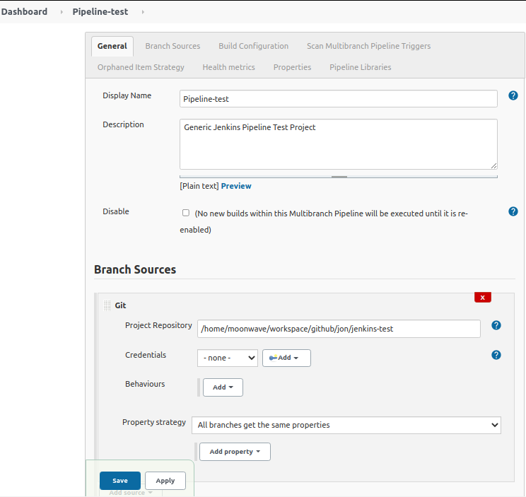
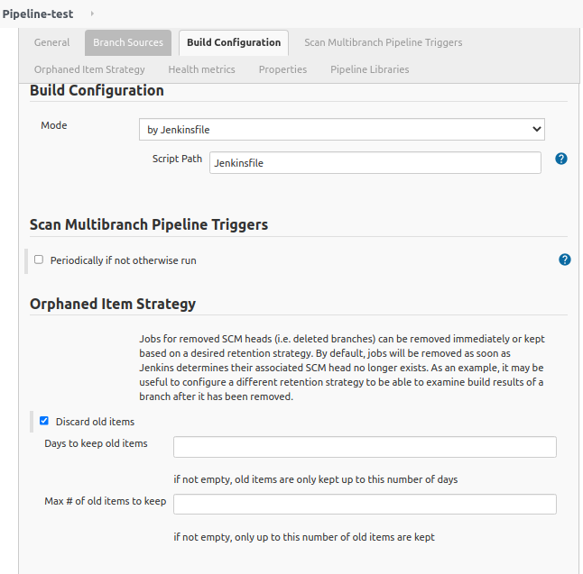
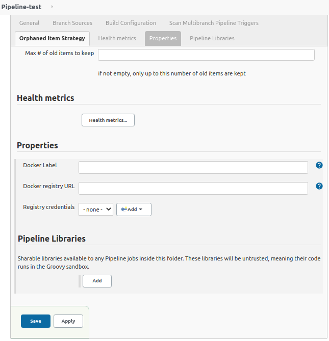

This project was configured for local access on Jenkins server w/o remote git api calls  
Local changes needed to be committed first, then go to Jenkins UI todo a rebuild  
See ~/workspace/github/mw/svr/jenkins/sample-jobs/Pipeline-test  
 
 
 
